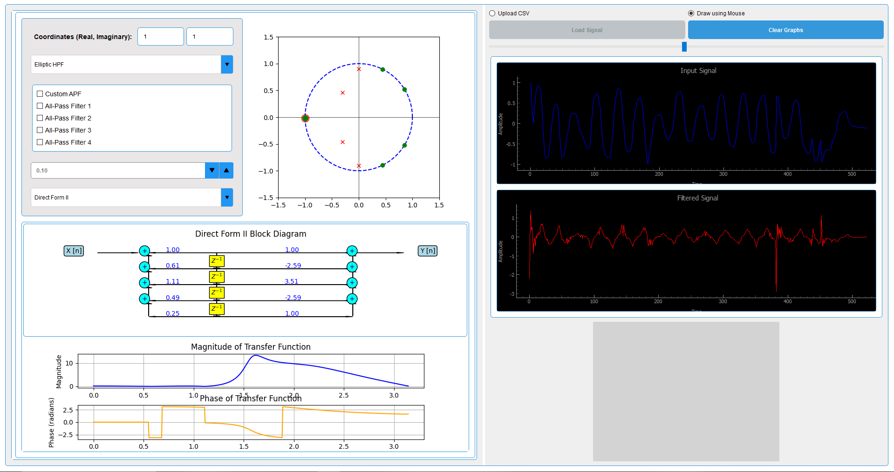

# Digital Filter Designer

[](https://www.python.org/)
[](LICENSE)
[](https://pypi.org/project/PyQt5/)
[](https://matplotlib.org/)
[](https://www.scipy.org/)





## Overview

The Digital Filter Designer is a powerful application built using PyQt5 and Matplotlib. It allows users to design and visualize digital filters, including standard filters and all-pass filters, and generate corresponding C code. This tool is ideal for students, researchers, and engineers working in the field of digital signal processing.

## Main Features

- **Z-Plane Plotting**: Visualize zeros and poles on the Z-plane.
- **Standard Filter Design**: Design Butterworth, Chebyshev, Bessel, and Elliptic filters.
- **All-Pass Filter Design**: Create custom all-pass filters and predefined all-pass filters.
- **Real-Time Signal Plotting**: Load signals from CSV files or draw signals using the mouse.
- **Transfer Function Visualization**: View the magnitude and phase response of the designed filter.
- **C Code Generation**: Generate C code for the designed filter for easy integration into other projects.

## Getting Started

### Prerequisites

Ensure you have the following installed:

- Python 3.x
- PyQt5
- Matplotlib
- NumPy
- SciPy
- Pandas
- Jinja2
- PyQtGraph

### Installation

1. Clone the repository:
    ```sh
    git clone https://github.com/HarmoniCode/Digital-filter.git
    ```
2. Navigate to the project directory:
    ```sh
    cd Digital-filter
    ```
3. Install the required packages:
    ```sh
    pip install -r requirements.txt
    ```

### Running the Application

1. Navigate to the project directory:
    ```sh
    cd Digital-filter
    ```
2. Run the main application:
    ```sh
    python main.py
    ```

## Usage

### Z-Plane Plotting

- Add zeros and poles to the Z-plane by entering their coordinates and clicking the "Add Zero" or "Add Pole" buttons.
- Visualize the effect of the zeros and poles on the filter's transfer function in real-time.

### Standard Filter Design

- Select a standard filter type (e.g., Butterworth, Chebyshev) from the dropdown menu.
- The application will automatically plot the zeros and poles for the selected filter.

### All-Pass Filter Design

- Create custom all-pass filters by adjusting the parameter [a](http://_vscodecontentref_/0) using the spinbox.
- Select predefined all-pass filters from the list of checkboxes.

### Real-Time Signal Plotting

- Load a signal from a CSV file by clicking the "Load Signal" button.
- Draw a signal using the mouse by selecting the "Draw using Mouse" option.

### Transfer Function Visualization

- View the magnitude and phase response of the designed filter in the transfer function plot.

### C Code Generation

- Generate C code for the designed filter by clicking the "C Code" button.
- The generated code will be displayed in a pop-up window and saved and .c file .

## License

This project is licensed under the MIT License.

## Contributing

Contributions are welcome! Please fork the repository and submit a pull request with your changes. For major changes, please open an issue first to discuss what you would like to change.

## Contact

For any questions or feedback, please contact [HarmoniCode](https://github.com/HarmoniCode).
